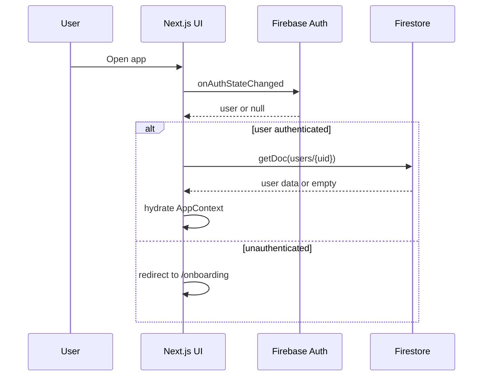
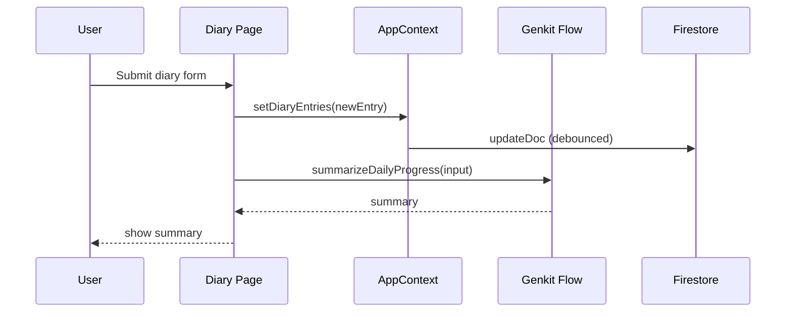
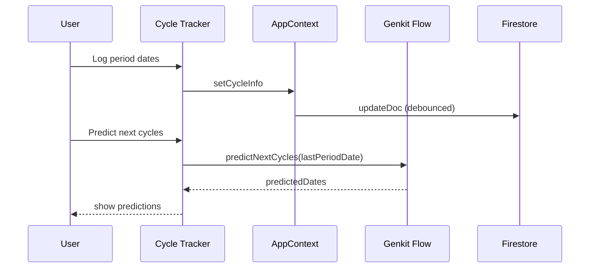

# EmpowerYou — Full Project Deep Dive

This document is an exhaustive, file-by-file explanation of the EmpowerYou codebase as it exists in this workspace. It covers architecture, data flow, feature behavior, configuration, and UI primitives.

## 1) High-Level Overview
EmpowerYou is a Next.js (App Router) client-side web application focused on personal wellbeing. It provides a dashboard and multiple trackers (tasks, goals, cycle tracking, health metrics, diary, relationship reflections) and augments them with AI-generated summaries and insights using Genkit + Google AI.

Key characteristics:
- App Router in `src/app` with a route group for authenticated app content.
- Firebase Auth + Firestore for user accounts and data persistence.
- Client-side state in a single `AppContext` provider that syncs to Firestore.
- Tailwind CSS + shadcn/ui (Radix-based) component library.
- Genkit flows for AI features.

## 2) How the App Runs
- `npm run dev` starts Next.js on port 9002 (`package.json`).
- Genkit flows can be started with `npm run genkit:watch` (`src/ai/dev.ts`).

Note: `next.config.ts` sets `typescript.ignoreBuildErrors = true`, so type errors won’t block builds.

## 3) App Architecture and Data Flow

### 3.1 Root Layout and Providers
- `src/app/layout.tsx` sets global metadata, loads Poppins from Google Fonts, imports `globals.css`, and wraps all routes with:
  - `ThemeProvider` (`src/context/theme-context.tsx`) for dark mode class toggling.
  - `AppProvider` (`src/context/app-context.tsx`) for app state.
  - `Toaster` (`src/components/ui/toaster.tsx`) for toast notifications.

### 3.2 Routing & Navigation
- Root entry (`src/app/page.tsx`) checks `authStatus` and redirects to `/dashboard` or `/onboarding`.
- `/onboarding` renders the sign-in/up/reset UI (`src/app/onboarding/page.tsx`).
- The authenticated UI is inside the `src/app/(app)` route group:
  - `src/app/(app)/layout.tsx` is the app shell with `Sidebar` and `SidebarInset`, and a mobile header.
  - `src/components/nav.tsx` defines sidebar links (dashboard, trackers, companion, insights).

### 3.3 Auth & Session Flow
- Firebase Auth is configured in `src/lib/firebase.ts`.
- `AppProvider` registers `onAuthStateChanged` and sets `authStatus` to `authenticated` or `unauthenticated`.
- On login, Firestore document `users/{uid}` is loaded and hydrated into local state. If absent, it creates a doc with mock defaults.
- On logout, local state is reset to defaults.

### 3.4 Persistence Strategy
- Primary persistence is Firestore via `updateDoc` (debounced) inside `AppProvider` setters.
- A small subset of UI preferences is stored in localStorage (theme and companion name).

Important mismatch:
- `README.md` claims “all data stored in localStorage,” but the actual implementation stores user data in Firestore. This should be reconciled.

### 3.5 AI/Genkit Flow Integration
- Genkit setup in `src/ai/genkit.ts`, using `googleai/gemini-2.5-flash`.
- Flows are defined in `src/ai/flows/*` and imported by UI pages.
- Flows are executed in client components using the exported async functions.

## 4) Feature-by-Feature Walkthrough

### Dashboard (`src/app/(app)/dashboard/page.tsx`)
- Shows snapshot cards for goals, tasks, cycle, diary, health metrics, and insights.
- Uses `AppContext` for data.
- `CompanionGreeting` produces a time-of-day message.

### Wants & Needs (`src/app/(app)/wants-needs/page.tsx`)
- Manages `Goal[]` with category `want | need`.
- Add/edit goals via dialogs (title, description, category, progress).
- Splits goals into tabs. Uses `date-fns` to format deadlines.

### Tasks (`src/app/(app)/tasks/page.tsx`)
- Manages `Task[]` with priority and completion status.
- Inline edit dialog and dropdown menu to update priority or delete.
- Uses toasts for feedback.

### Health Metrics (`src/app/(app)/health-metrics/page.tsx`)
- Logs mood and energy for today.
- Displays last 7 days in a Recharts AreaChart.
- Data stored as `HealthMetric[]` with `date` string and `createdAt`.

### Cycle Tracker (`src/app/(app)/cycle-tracker/page.tsx`)
- Logs a date range with `react-day-picker`.
- Calculates cycle day and next period based on a fixed 28-day cycle.
- AI flows:
  - `predictNextCycles` for future dates.
  - `suggestSymptomRelief` for gentle suggestions.

### Diary (`src/app/(app)/diary/page.tsx`)
- Multi-field diary entry form.
- Saves diary entry to state and runs `summarizeDailyProgress` AI flow to generate a summary.

### Relationship Tracker (`src/app/(app)/relationship-tracker/page.tsx`)
- Rates “my behavior” and “their behavior” with emoji scale.
- Saves freeform logs and plans to `anasReflection` state.
- Displays a “weekly report” dialog from the most recent reflection.


### Companion (`src/app/(app)/companion/page.tsx`)
- Chat UI storing messages in `chatHistory`.
- Calls `converseWithCompanion` AI flow.
- Uses `ScrollArea` and avatars for chat layout.

### Insights (`src/app/(app)/insights/page.tsx`)
- Generates AI insights across all app data via `generatePersonalizedInsights`.
- Generates a shareable summary via `generateShareableSummary` and allows copy-to-clipboard.

### Settings (`src/app/(app)/settings/page.tsx`)
- Change companion name.
- Change password using Firebase reauthentication.
- Toggle dark mode.
- Clear local settings (theme + companion name).
- Sign out.

## 5) State and Data Model

Defined in `src/lib/types.ts`:
- `Task`: id, text, completed, priority, createdAt.
- `Goal`: id, title, category, progress, deadline, description, createdAt.
- `CycleInfo`: currentDay, nextPeriodIn, predictedDate, lastPeriodDate.
- `HealthMetric`: date, mood, energy, bloodPressure?, createdAt.
- `DiaryEntry`: dailyRemark, diaryEntry, wantsNeedsProgress, mood, energyLevels, partnerReflection, createdAt.
- `AnasReflection`: myBehavior, hisBehavior, progressLog, plans.
- `ChatMessage`: role, content.

Initial defaults in `src/lib/data.ts`.

## 6) Auth + Firestore Integration

- Firebase configuration in `src/lib/firebase.ts`.
- `AppProvider` uses Firestore document `users/{uid}` to store all app data:
  - tasks, goals, healthMetrics, cycleInfo, loggedSymptoms, diaryEntries, anasReflection, chatHistory.
- Writes are debounced (1s) in `writeToDb`.

### 6.1 Firestore Document Example

Collection: `users`
Document: `users/{uid}`

Example shape (JSON-like):
```json
{
  "userName": "Jane Doe",
  "email": "jane@example.com",
  "createdAt": "2026-03-26T10:15:00.000Z",
  "companionName": "Sage",
  "tasks": [
    {
      "id": "1711440000000",
      "text": "Meditate for 10 minutes",
      "completed": false,
      "priority": "medium",
      "createdAt": "2026-03-26T08:00:00.000Z"
    }
  ],
  "goals": [
    {
      "id": "g1711440000000",
      "title": "Practice guitar",
      "category": "want",
      "progress": 35,
      "deadline": "2026-04-25T00:00:00.000Z",
      "description": "Learn 2 songs",
      "createdAt": "2026-03-26T08:10:00.000Z"
    }
  ],
  "healthMetrics": [
    {
      "date": "Mar 26",
      "mood": 4,
      "energy": 3,
      "createdAt": "2026-03-26T09:00:00.000Z"
    }
  ],
  "cycleInfo": {
    "currentDay": 5,
    "nextPeriodIn": 23,
    "predictedDate": "2026-04-18T00:00:00.000Z",
    "lastPeriodDate": "2026-03-21T00:00:00.000Z"
  },
  "loggedSymptoms": [
    "Cramps",
    "Fatigue"
  ],
  "diaryEntries": [
    {
      "dailyRemark": "Busy but productive",
      "diaryEntry": "Felt more focused in the afternoon...",
      "wantsNeedsProgress": "Practiced guitar",
      "mood": "Hopeful",
      "energyLevels": "Medium",
      "partnerReflection": "Nice talk after dinner",
      "createdAt": "2026-03-26T21:30:00.000Z"
    }
  ],
  "anasReflection": {
    "myBehavior": "4",
    "hisBehavior": "4",
    "progressLog": "We communicated calmly today",
    "plans": "Plan a weekend walk"
  },
  "chatHistory": [
    { "role": "user", "content": "Today was a bit heavy." },
    { "role": "model", "content": "That sounds tough. Want to talk about it?" }
  ]
}
```

### 6.2 Firestore Notes
- Dates are stored as ISO strings in most arrays to make serialization simple.
- Some fields are converted back to `Date` objects on read (goals and cycleInfo).
- `updateDoc` is debounced, so rapid UI updates will coalesce into fewer writes.

## 7) AI Flows (Genkit)

### `converse-with-companion.ts`
- Prompt-driven friend/companion persona with conversation history.

### `summarize-daily-progress.ts`
- Summarizes diary entry into a warm recap.

### `predict-next-cycles.ts`
- Predicts next three cycles with a fixed 28-day assumption.

### `suggest-symptom-relief.ts`
- Provides non-medical comfort suggestions based on symptoms list.

### `generate-personalized-insights.ts`
- Combines all app data into insights, summary, and advice.

### `generate-shareable-summary.ts`
- Produces a shareable, partner-facing summary written in the user’s voice.

## 7.1 Sequence Diagrams

Login + Data Hydration:


Diary Summary Flow:


Cycle Prediction Flow:


## 8) UI and Component Library

The UI layer is mostly shadcn/ui wrappers around Radix primitives. Each file is a styled component wrapper or small helper.

### App-Specific Components
- `src/components/app-logo.tsx`: “EmpowerYou” logo with sparkles icon.
- `src/components/nav.tsx`: Sidebar navigation list.
- `src/components/profile-button.tsx`: User avatar dropdown with theme toggle, settings, sign-out.
- `src/components/app-gate.tsx`: Auth guard component (not currently used in `src/app/layout.tsx`).

### UI Components (`src/components/ui/*`)
- `accordion.tsx`: Radix Accordion with trigger rotation and animation.
- `alert-dialog.tsx`: Radix AlertDialog wrapper with overlay/content/title/description/action/cancel.
- `alert.tsx`: Alert component with variants via class-variance-authority.
- `avatar.tsx`: Avatar, AvatarImage, AvatarFallback.
- `badge.tsx`: Small badge with variant styling.
- `button.tsx`: Button with variants and sizes.
- `calendar.tsx`: DayPicker wrapper with theme classes and chevron icons.
- `card.tsx`: Card container with header/content/footer subcomponents.
- `carousel.tsx`: Embla-based carousel with prev/next controls.
- `chart.tsx`: Recharts wrapper with theming, legend, tooltip helpers.
- `checkbox.tsx`: Radix Checkbox with check icon.
- `collapsible.tsx`: Radix Collapsible wrappers.
- `dialog.tsx`: Radix Dialog wrapper with overlay/content/close.
- `dropdown-menu.tsx`: Radix DropdownMenu with checkbox/radio items and submenus.
- `form.tsx`: React Hook Form helpers (FormField, FormItem, etc.).
- `input.tsx`: Styled input.
- `label.tsx`: Styled label.
- `menubar.tsx`: Radix Menubar with submenu and radio/checkbox.
- `popover.tsx`: Radix Popover wrapper.
- `progress.tsx`: Radix Progress wrapper.
- `radio-group.tsx`: Radix RadioGroup with circle indicator.
- `scroll-area.tsx`: Radix ScrollArea with custom scrollbar.
- `select.tsx`: Radix Select with scroll buttons.
- `separator.tsx`: Radix Separator.
- `sheet.tsx`: Drawer component (Dialog-based).
- `sidebar.tsx`: Custom sidebar system with mobile sheet and keyboard toggle.
- `skeleton.tsx`: Loading skeleton.
- `slider.tsx`: Radix Slider.
- `switch.tsx`: Radix Switch.
- `table.tsx`: Table wrappers.
- `tabs.tsx`: Radix Tabs.
- `textarea.tsx`: Styled textarea.
- `toast.tsx`: Radix Toast with variants.
- `toaster.tsx`: Toast container wired to `useToast`.
- `tooltip.tsx`: Radix Tooltip.

## 9) Styling & Design Tokens

- `src/app/globals.css` defines CSS variables for light/dark theme, including chart colors, border radius, and background/foreground.
- `tailwind.config.ts` maps CSS variables into Tailwind theme colors and adds animations:
  - `accordion-down`, `accordion-up`, `fade-in-up`.
- Fonts: Poppins loaded in `src/app/layout.tsx` and used via Tailwind `font-body` and `font-headline` classes.

## 10) Hooks
- `src/hooks/use-toast.ts`: Toast state + dispatch system (inspired by react-hot-toast).
- `src/hooks/use-mobile.tsx`: Screen-size detection (breakpoint 768px).

## 11) Configuration and Metadata Files

- `package.json`: project scripts and dependencies.
- `next.config.ts`: Next settings, remote image domains, TS build errors ignored.
- `tailwind.config.ts`: theme configuration, CSS variables, animations.
- `postcss.config.mjs`: Tailwind plugin.
- `components.json`: shadcn/ui config.
- `docs/blueprint.md`: original product/UX blueprint.
- `README.md`: general overview (note mismatch with Firestore).

## 12) File-by-File Inventory (Complete)

### Root
- `README.md`: App summary, tech stack, quick-start instructions.
- `package.json`: scripts and dependencies.
- `package-lock.json`: dependency lock.
- `next.config.ts`: Next.js config, images, TS ignore.
- `tailwind.config.ts`: Tailwind setup with CSS variables.
- `postcss.config.mjs`: Tailwind PostCSS plugin.
- `tsconfig.json`: TypeScript settings and path aliases.
- `components.json`: shadcn config.
- `next-env.d.ts`: Next.js TS types.
- `docs/blueprint.md`: initial design/feature blueprint.

### `src/app`
- `layout.tsx`: Root layout with global styles, providers, and fonts.
- `globals.css`: CSS variables and base styles.
- `page.tsx`: Root redirect by auth state.
- `loading.tsx`: Root loading screen.
- `favicon.ico`: App icon.
- `onboarding/page.tsx`: Sign-in, sign-up, password reset, email verification.

### `src/app/(app)`
- `layout.tsx`: Authenticated layout with sidebar.
- `loading.tsx`: App loading screen.
- `dashboard/page.tsx`: Dashboard summary view.
- `wants-needs/page.tsx`: Goals tracker.
- `tasks/page.tsx`: Task manager.
- `health-metrics/page.tsx`: Mood/energy logging + chart.
- `cycle-tracker/page.tsx`: Cycle logging + AI predictions.
- `diary/page.tsx`: Diary entry + AI summary.
- `relationship-tracker/page.tsx`: Relationship reflection UI.
- `companion/page.tsx`: AI companion chat.
- `insights/page.tsx`: AI insights + shareable summary.
- `settings/page.tsx`: Preferences and password change.

### `src/ai`
- `genkit.ts`: Genkit setup with Google AI plugin.
- `dev.ts`: Dev entrypoint for Genkit.
- `flows/converse-with-companion.ts`: Companion chat flow.
- `flows/summarize-daily-progress.ts`: Diary summarizer flow.
- `flows/predict-next-cycles.ts`: Cycle prediction flow.
- `flows/suggest-symptom-relief.ts`: Symptom relief flow.
- `flows/generate-personalized-insights.ts`: Full insights report flow.
- `flows/generate-shareable-summary.ts`: Shareable day summary flow.

### `src/context`
- `app-context.tsx`: Global state, Firestore integration, setters.
- `theme-context.tsx`: Dark/light theme toggling.

### `src/components`
- `app-logo.tsx`: Logo component.
- `nav.tsx`: Sidebar navigation.
- `profile-button.tsx`: User profile dropdown.
- `app-gate.tsx`: Auth gate component (unused).
- `ui/*`: All UI components listed above.

### `src/hooks`
- `use-toast.ts`: Toast system.
- `use-mobile.tsx`: Mobile breakpoint detection.

### `src/lib`
- `types.ts`: Domain models.
- `data.ts`: Mock/default values.
- `firebase.ts`: Firebase app/auth/db config.
- `utils.ts`: `cn()` className helper.
- `placeholder-images.ts`: Placeholder image list wrapper.
- `placeholder-images.json`: Empty placeholder dataset.

## 13) Known Mismatches / Risks
- README promises localStorage-only persistence, but the app actively uses Firestore.
- TypeScript build errors are ignored by configuration.

## 14) Suggested Next Documentation Enhancements (Optional)
- Add a data schema example for Firestore `users/{uid}`.
- Add sequence diagrams for key flows (login, AI summary, cycle prediction).
- Add a “known gaps” list (e.g., weekly summary not implemented).
